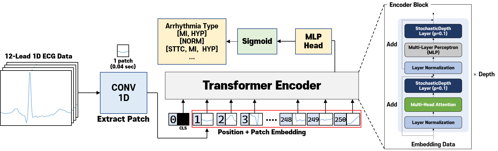
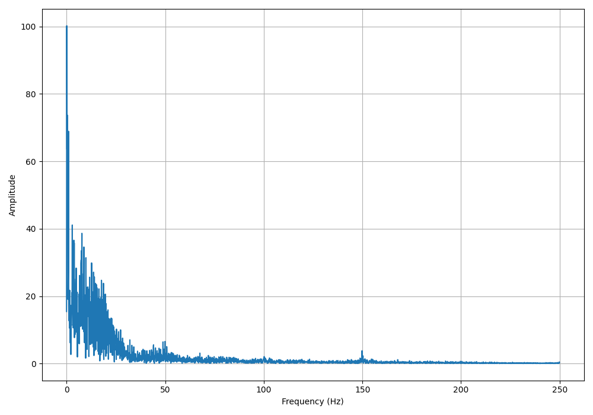
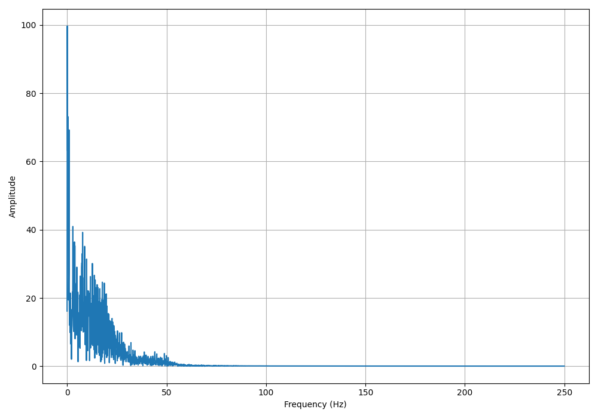
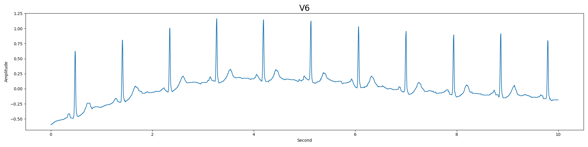
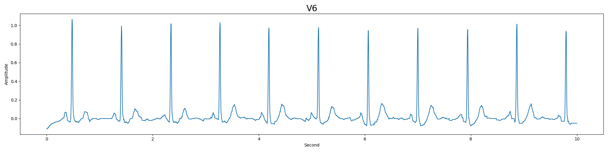
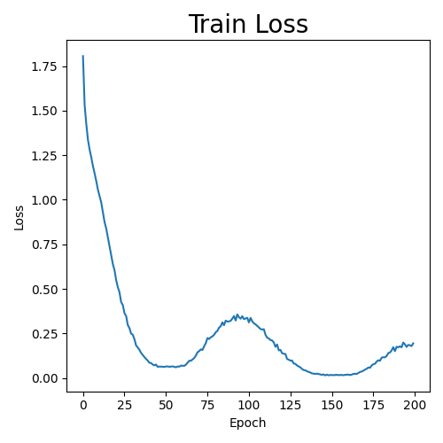
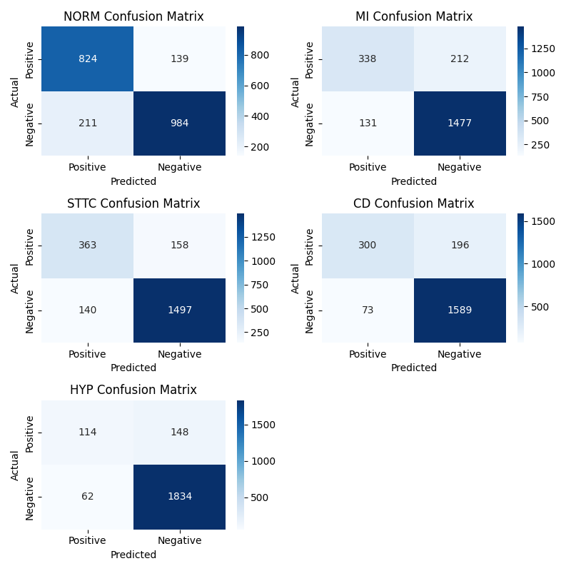
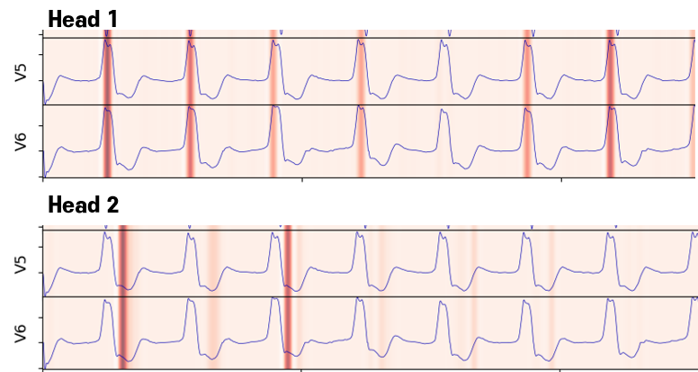

# LeeJeongHwi  Master's Thesis

### Title : Interpretable Arrhythmia Type Classification Using Vision Transformer Model

### Environment

* Python 3.10.13

* Pytorch 2.1.0
* Scikit-learn 1.3.2
* numpy 1.26.0
* pandas 2.1.3
* ecg-plot 0.2.8
* einops 0.7.0
* pytorch-model-summary 0.1.2
* scipy 1.11.4
* seaborn 0.13.0

### Database

[PTB-XL, a large publicly available electrocardiography dataset](https://physionet.org/content/ptb-xl/1.0.3/) 1.0.3

### Model Summary

### Filtering

**Highpass Filter (for Powerline Noise Remove)**

Before

After

**Median Filter (for Baseline Wander Noise Remove)**

Before

After

### Train

Train Loss

### Evaluation

### Visualization

Conduction Disturbance (Type : LBBB)

---

Reference

https://github.com/yonigottesman/ecg_vit

